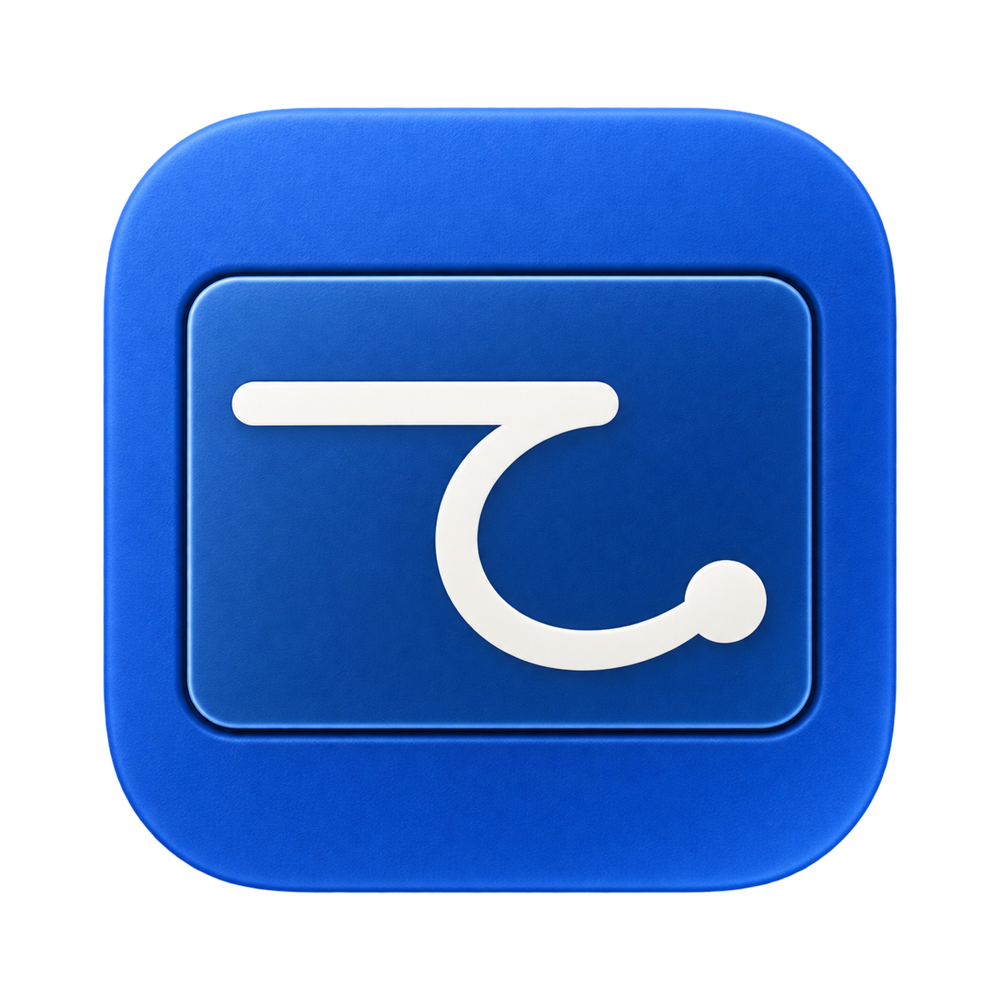
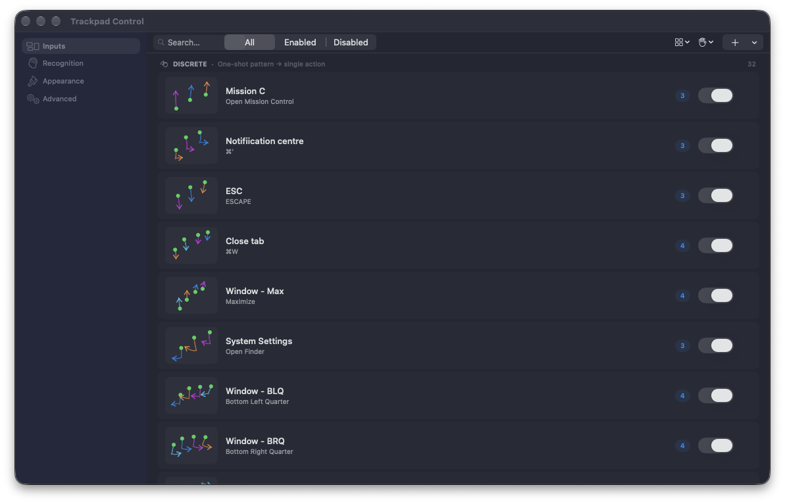

# Trackpad Control

<p align="center">
  
</p>

Trackpad Control is a macOS menu bar app that turns custom multi-finger trackpad gestures into actions like app launch, keyboard shortcuts, and window management.

It is built for power users who want gesture automation on Mac without opening full automation tools.

## Download

[**→ Download trackpad_control.zip from the latest release**](https://github.com/Smoep/trackpad_control/releases/latest)

Unzip and drag **trackpad_control.app** to your Applications folder. New installs
from the prebuilt release start with a library of 51 recorded gestures, so you can
enable, adapt, or delete examples instead of recording everything from scratch.

> **First launch:** macOS will show a security warning because the app is not signed with an Apple Developer certificate.
> Right-click (or Control-click) the app → **Open** → **Open**. You only need to do this once.

## Interface



The gesture library keeps recorded paths, finger counts, assigned actions, and
enable controls visible in one place. Recognition, appearance, and advanced
diagnostics are available from the sidebar.

## What’s new in v1.2.2

- Gesture overlays now appear reliably on every desktop Space.
- Cycle Windows uses native Mission Control highlighting without rearranging windows.
- Window cycling follows the visual left-to-right order and responds more consistently.
- New app icon and matching light/dark menu-bar glyph.

See the [full v1.2.2 release notes](docs/releases/v1.2.2.md).

## What It Does

- Records one to five finger gestures on the Mac trackpad
- Matches gestures with a shape-based recognizer tuned for noisy real-world input
- Triggers actions: launch apps, run shortcuts, execute continuous actions, and control windows
- Runs from the menu bar with configurable settings and optional overlay diagnostics

## Build & install

Requires macOS 26 and Xcode 26+.

```bash
git clone https://github.com/Smoep/trackpad_control.git
cd trackpad_control
xcodebuild -project trackpad_control.xcodeproj -scheme trackpad_control -configuration Release \
  -derivedDataPath build-release build
cp -R build-release/Build/Products/Release/trackpad_control.app /Applications/trackpad_control.app
open /Applications/trackpad_control.app
```

## Keywords

macOS, trackpad gestures, gesture recognition, gesture automation, menu bar app, window management, productivity, SwiftUI, multitouch
